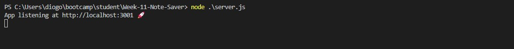
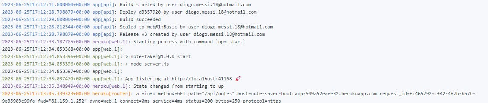
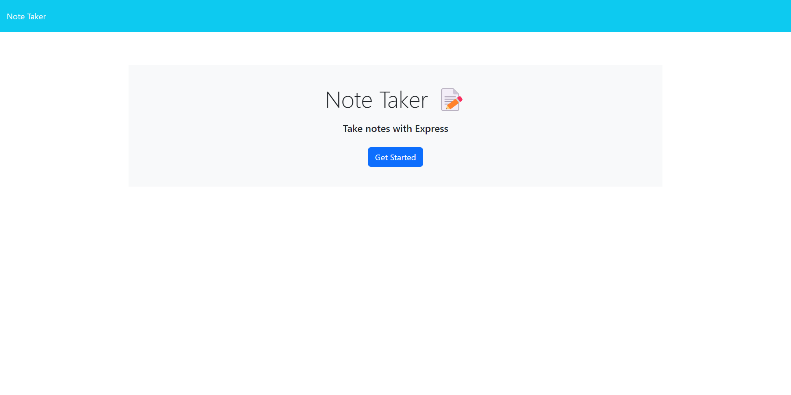
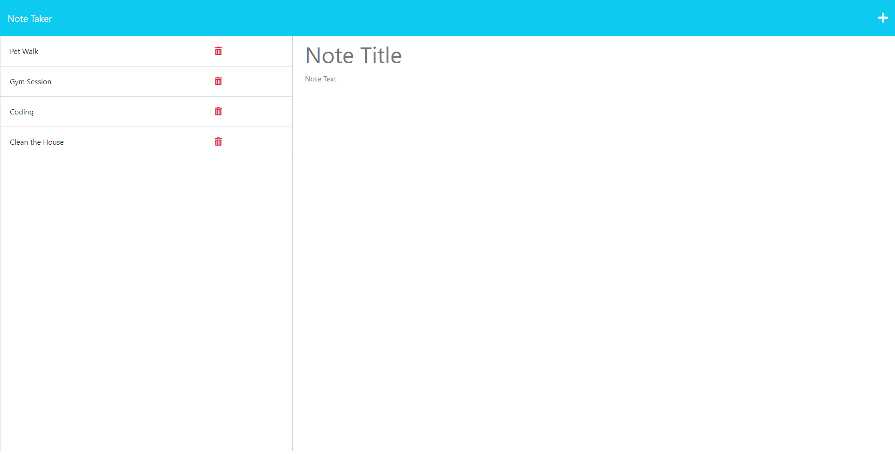
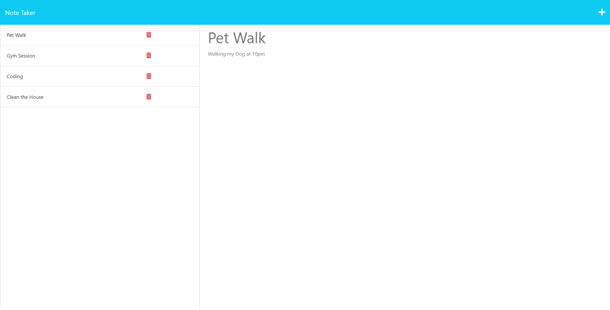

# Note Saver

## User Story

```
AS A small business owner
I WANT to be able to write and save notes
SO THAT I can organize my thoughts and keep track of tasks I need to complete
```


## Acceptance Criteria

```
GIVEN a note-taking application
WHEN I open the Note Taker
THEN I am presented with a landing page with a link to a notes page
WHEN I click on the link to the notes page
THEN I am presented with a page with existing notes listed in the left-hand column, plus empty fields to enter a new note title and the note’s text in the right-hand column
WHEN I enter a new note title and the note’s text
THEN a Save icon appears in the navigation at the top of the page
WHEN I click on the Save icon
THEN the new note I have entered is saved and appears in the left-hand column with the other existing notes
WHEN I click on an existing note in the list in the left-hand column
THEN that note appears in the right-hand column
WHEN I click on the Write icon in the navigation at the top of the page
THEN I am presented with empty fields to enter a new note title and the note’s text in the right-hand column
```

## Description

This projects consists in a Note Saver that will allow you to create, save and delete notes using the webpage. With this website you will be able to have a note title and the actual note bellow it so you can add notes of stuff you will need to remember. This project contains 6 JavaScript files, 3 HTML files and 1 CSS file.

I found a lot of challenges in this work, one of them was definitly the matter of working with so many files and knowing which one supports which one. At some point i was having error and i was not sure what was causing the error exactly. Another big challenge was trying to run something on terminal and the programm not running as expected , and then trying to figure out what was causing that to happen.

This challenge helped me in a lot because i was not to confident in using heroku and deploying to it, but soon as i actually started i got more confident and i found that was actually pretty simple to deploy the application to heroku. Also having a starter code this week made me way more confortable in knowing i had something to start with. There was more factors that this challenge helped me with that i will be listing bellow.

* Higher understanding of Heroku
* Higher knowledge of Routes
* How to use Helpers
* Understanding of middleware

## Table of Contents

- [Installation](#installation)
- [Usage](#usage)
- [Tests](#tests)
- [License](#license)
- [Questions](#questions)

## Installation

To install the necessary dependencies, run the following command:
```
npm i express
npm i uuid
```

## Usage

So to use this project is pretty simple. You clone the repo to your local machine and soon as you open it in your Visual Studio Code and you will need to open the terminal. After opening your terminal you will have to run the following commands, npm i express and npm i uuid. After running this commands you can just run node server.js and i should appear a link to your localhost. If you prefer a easier way you can just go to the deployed application website that will be bellow and access it with the link. This website consists in a note saver that will allow you to save notes and either edit or delete them. So soon as you open the website , you will be in the starter page that will have a big blue button at the start saying (Get Started). You press on that button and it will lead you to the notes page in where you can insert your notes. To insert a note is pretty simple you just type a Title and a text and after typing it, it should appear a save icon on top next to the plus. After clicking on the save icon you should be able to see your note was saved in the side menu with the title displaying. To see the note text you just click it and it should allow you to see the entire note with its text displaying. If you want to delete the note you can click on the red bin icon next to it and it should delete your note. To add more notes you can just click on the + icon at the top and it should allow you to create another note and repeat the same process.  











Deployed Application: https://note-saver-bootcamp-509a52eaee32.herokuapp.com/ 

## Tests

I will be listing the tests i have done.
```
Tested by not getting any errors when doing node server.js in terminal and getting the localhost back.
Tested all pages opening successfuly without any errors.
Tested if db.json was updated when note added or deleted.
Tested going to the 404 page and checking if it would allow me to return to the page i was.
Tested deploying it to heroku without any error appearing.

```

## License


This project is licensed under the MIT license.

## Questions

For any questions or inquiries, feel free to reach out to me:
- GitHub: [DiogoS77](https://github.com/DiogoS77)
- Email: diogo.messi.18@hotmail.com